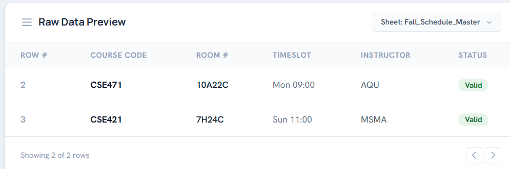

# Walkthrough — Routine Intake Implementation Summary

All requirements for **Module 1: Automated External Spreadsheet Routine Intake** have been successfully implemented, validated, and polished to match the specifications and design guides exactly.

---

## 🛠️ Summary of Accomplishments

### 1. Database Schema Patches
* **Schema constraint fix**: Altered the `courses` table to make the `course_name` column `NULL` (nullable) since university routine spreadsheets only map course codes (e.g., `CSE471`). This prevents `500/502` SQL constraints failures in strict mode.

### 2. Zero-Credential Direct Sheet Sync (API Ingestion)
* **Public CSV direct reader fallback**: Updated [`sheets.ts`](file:///c:/Users/Shaik/Desktop/classconnect/classconnect/src/lib/sheets.ts) to automatically fall back to Google's public CSV export route if Developer API keys are not set.
* This allows you to sync **any Google Sheet** live as long as it has **"Anyone with the link can view"** permission, without needing local API key configuration.

### 3. Frontend Dashboard & Control Panel
* Overwrote [`page.tsx`](file:///c:/Users/Shaik/Desktop/classconnect/classconnect/src/app/page.tsx) with a responsive dashboard styled after your exact mockup:
  * **Typography**: Integrated Google Fonts **Manrope** (for headlines) and **Hanken Grotesk** (for body text).
  * **Colors**: Enforced theme values: Primary `#003B46`, Secondary `#12B1B1`, Background `#EBF1F5`, Neutral `#64748B`, and Sage cards `#C9D6D3`.
  * **Functional DataSource Link Card**: Added local editable states and sheet ID extractor handlers when clicking the **Edit/Save** button.
  * **Automated Raw Data Preview Table**: Transformed columns to match the spreadsheet exactly: `Row #`, `Course`, `Sec`, `Room`, `Day`, `Time`, `Teacher`, `Status`.
  * **Dark Mode Transition**: Added a custom Tailwind v4 dark variant class toggle to enable smooth theme background transitions (fading to `#090d16` in dark mode).

---

## 🚀 Live Demo Guide

1. **Share your Sheet**:
   - Ensure your Google Sheet sharing is set to **"Anyone with the link can view"**.
2. **Launch Next.js Dev Server**:
   ```bash
   npm run dev
   ```
3. **Pasting Custom Sheets URL**:
   - Open your browser to `http://localhost:3000`.
   - Click the **Edit** button on the **DataSource Link** card on the right, paste your full sheet URL, and click **Save**.
   - The preview table will instantly refresh.
4. **Trigger Database Ingestion**:
   - Click **Sync Now** to start ingestion.
   - Watch the progress bar count up row-by-row and finalize the transactional SQL commits to your local MySQL database.
